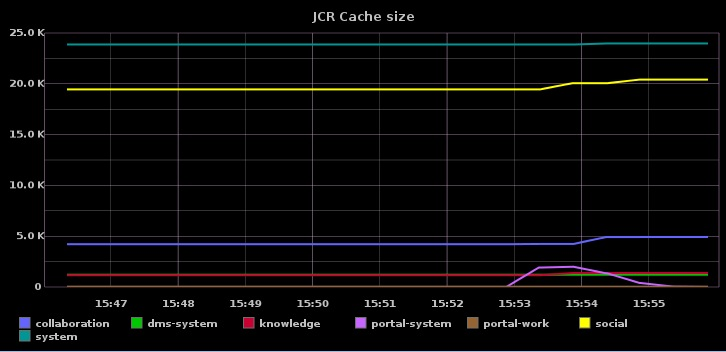

jmxtrans-addon
==============

This add-on integrate [Embedded JMXTrans](https://github.com/jmxtrans/embedded-jmxtrans) ([JMXTrans website](http://www.jmxtrans.org/)) into eXo Platform to collect eXo Caches metrics (or any other available MBean) and send them to [Graphite](https://github.com/graphite-project/graphite-web).

# Prerequisites

* a eXo Platform 4+ installation ([Community](http://community.exoplatform.com/portal/intranet/downloads), [Express or Enterprise](http://www.exoplatform.com/company/en/products/editions))
* a running Graphite server (if you don't want to deal with Graphite installation, you can just try with [Hosted Graphite](http://www.hostedgraphite.com/))

# Installation with eXo Platform add-on manager

1- In your <EXOPLATFORM>/bin/setenv-customize.sh file, add the following lines:

    CATALINA_OPTS="${CATALINA_OPTS} -Dgraphite.host=localhost"
    #CATALINA_OPTS="${CATALINA_OPTS} -Dgraphite.port=2003"
    #CATALINA_OPTS="${CATALINA_OPTS} -Dgraphite.namePrefix=servers.#escaped_hostname#."
    #CATALINA_OPTS="${CATALINA_OPTS} -Dgraphite.enabled=true"
    #CATALINA_OPTS="${CATALINA_OPTS} -Dgraphite.pickle.enabled=false"

    #CATALINA_OPTS="${CATALINA_OPTS} -Dgraphite.queryIntervalInSeconds=15"
    #CATALINA_OPTS="${CATALINA_OPTS} -Dgraphite.queryThreads=15"
    #CATALINA_OPTS="${CATALINA_OPTS} -Dgraphite.exportIntervalInSeconds=30"
    #CATALINA_OPTS="${CATALINA_OPTS} -Dgraphite.exportBatchSize=50"
    #CATALINA_OPTS="${CATALINA_OPTS} -Dgraphite.numExportThreads=5"

    #CATALINA_OPTS="${CATALINA_OPTS} -Dexo.jmxtrans.system.config=classpath:jmxtrans-exo.json,classpath:exo/app-caches.json,classpath:exo/jcr-caches.json"

You must at least fill `-Dgraphite.host=localhost` with the right graphite server url but you can also uncomment and change whatever parameter depending of your needs.

2- Install the [eXo Platform add-on manager](http://blog.exoplatform.com/en/2013/12/20/boost-platform-new-add-ons-manager) in your existing eXo Platform 4.x if it is not already done (prior to eXo Platform 4.1 RC1 only):

    cd <EXOPLATFORM_HOME>
    curl -L -o addons-manager-1.0.0-alpha-4.zip http://sourceforge.net/projects/exo/files/Addons/Add-ons%20Manager/addons-manager-1.0.0-alpha-4.zip/download
    unzip addons-manager-1.0.0-alpha-4.zip

Then install the jmxtrans-addon with the following command

    ./addon.sh install jmxtrans-addon:1.0.0-SNAPSHOT

3- Start your eXo Platform 4 and your metrics should arrive in your Graphite server ...

# If you want more metrics

We provide some other JMXTrans configuration file to monitor some other components :

| FILE NAME | DESCRIPTION |
| :------------- | :------------- |
| classpath:exo/jmxtrans-internals.json | JMXTrans internal health metrics |
| classpath:exo/jvm-oracle-hotspot.json | Oracle Hotspot JVM Metrics (Memory, Memory Pools, GC, Threads, OS) |
| classpath:exo/tomcat-7.json | Tomcat 7 Metrics (ThreadPool, Sessions, Requests, DataSources)|

If you want to include some of them simply use the `exo.jmxtrans.system.config` environment variable :

	CATALINA_OPTS="${CATALINA_OPTS} -Dexo.jmxtrans.system.config=classpath:jmxtrans-exo.json,classpath:exo/app-caches.json,classpath:exo/jcr-caches.json,classpath:exo/jmxtrans-internals.json,classpath:exo/jvm-oracle-hotspot.json,classpath:exo/tomcat-7.json"

But you can also add you own JMXTrans configuration files and reference them with `file:///the/absolute/path/to/my-own-jmxtrans.json` in the `exo.jmxtrans.system.config` environment variable

	CATALINA_OPTS="${CATALINA_OPTS} -Dexo.jmxtrans.system.config=classpath:jmxtrans-exo.json,classpath:exo/app-caches.json,file:///etc/my-app/business-metrics.json"

For more informations on how to write JMXTrans configuration files, you can read [Embedded JMXTrans doc](https://github.com/jmxtrans/embedded-jmxtrans/wiki/Configuration).